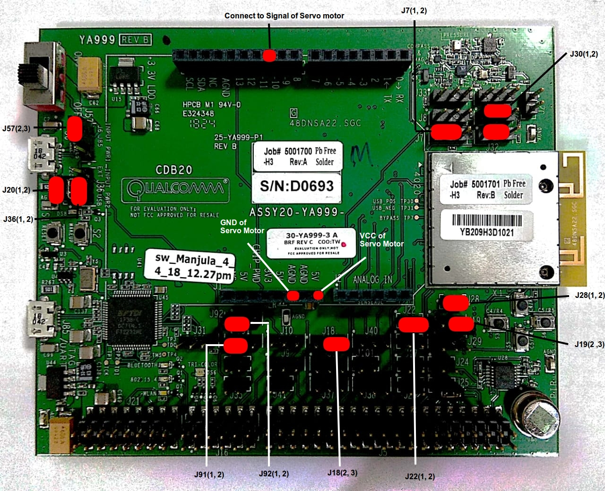
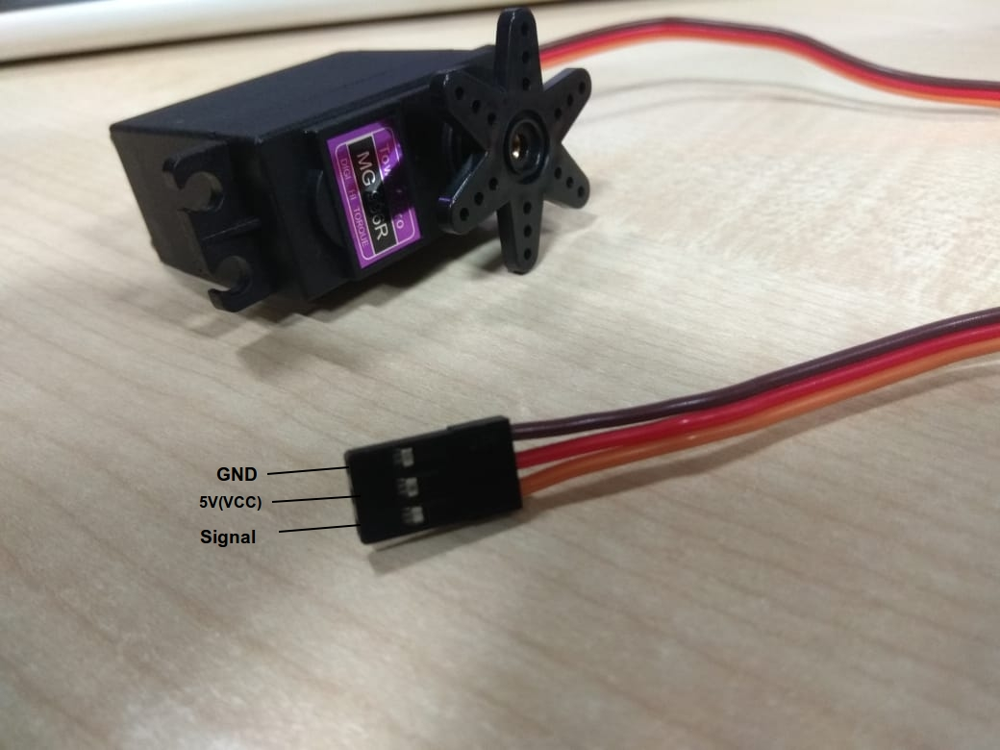
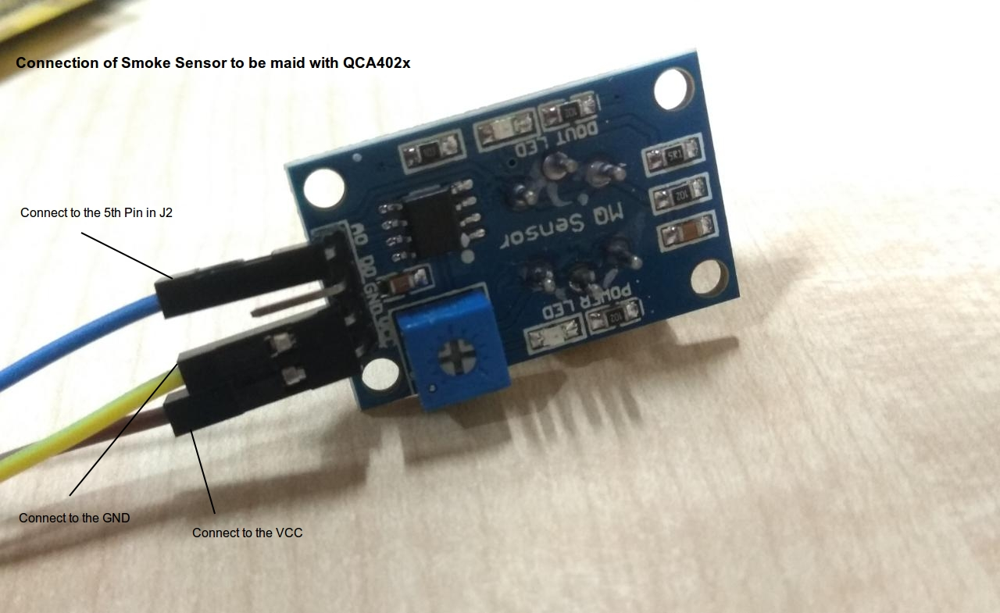

# Home-Control on Qualcomm QCA4020


The goal of this application is to connect with mobile devices and Bulb via BLE and other peripherals via General IO pins and control them.
Below are the list of connected devices:
 - Smart Bulb
 - Smart Lock
 - Smoke Detector

For Smart Bulb and Smart Lock, the android application has the control only to turn them ON and OFF. It is assumed that only one device of each is connected to the Board. For Smoke Detector, Smoke sensor data notified to android application for every 30 seconds from QCA402x, Doesn’t maintain any history data other than an hour information. 


# QCA 402X Board Application Installation

## Pre-requisite
 - QCA Board BLE named with prefix “QCA” to be discovered in the application.
 - Playbulbs’s BLE Bulb must be named as “HOME-BLB” to be discovered in the QCA402x.
 - Flashed Home Automation Binary on the board.
 - Smoke detector sensor should be connected to get proper values of smoke sensor.
 - Smart Lock(Servo Motor) should be connected with proper jumper settings, as shown below.
 - Setup the gcc-arm-none-eabi  toolchain and proper environment variable, to compile the source.
 - Setup the QCA402x sdk.
 - Python 2.7 or more has to be installed on windows system to run flashing program.
 - Install the QDLoader in windows to setup the flashtool.

## Application Installation
 - Copy the application folder in given path `QCA402x_sdk/target/quartz/demo/.`
 - Go to the `application_dir/build/gcc` from CMD/Terminal.
 - If working on `Linux`, run below command to build the binary
```sh
user@user:~$ cd /[path to application directory]/build/gcc
user@user:gcc$ make prepare
user@user:gcc$ make
```
 - If Working on `windows`, run below command to build binary
```sh
C:/ >cd /[path to application directory]/build/gcc
C:/[path to application directory]/build/gcc > build.bat
```
 - The above steps will generate the binary in `output` folder in `build/gcc` folder.
 - Now add jumper to pin `J34(1,2)` for setting the board to the `flash mode`.
 - Goto `output` directory from cmd, and type below command in windows to flash the binary on the board,
```sh
C:/[path to application directory]/build/gcc/output > py -2 QCA402x_sdk/target/build/tools/flash/qflash.py –comm=<USB Port Number>
```
`NOTE: Command must be run inside build/gcc/output directory presents in Application directory.`


## Hardware Setup
### Smart Lock
Jumper settings:




Pin Details of Servo motor:





### Smoke Sensor
pin connection:




### BLE Bulb
Connect Bulb to the power supply, and Rename the BLE name of bulb to the “HOME-BLB”

